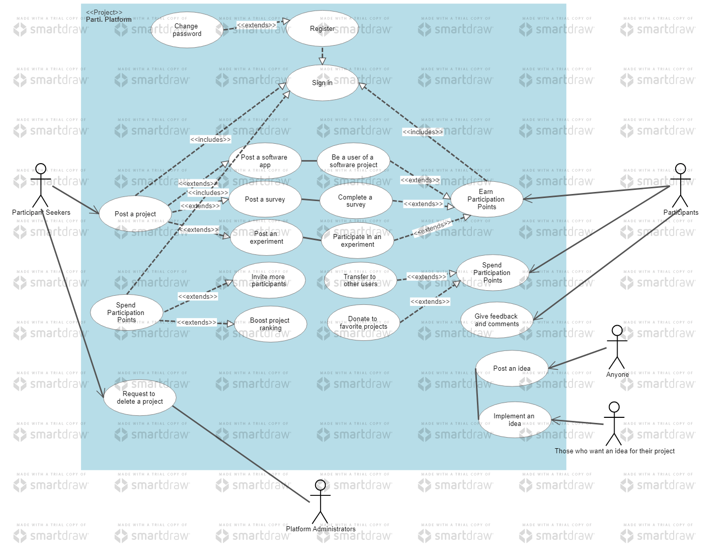
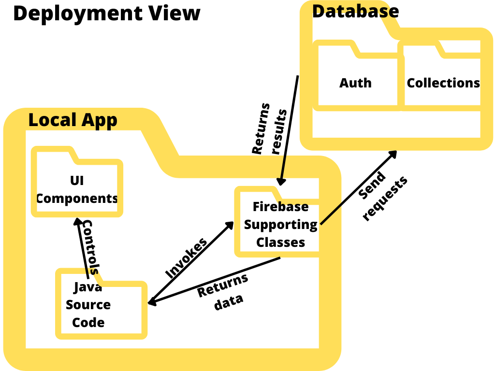

# Parti.
Main repository for team MetaNDroids (5174), Apollo 11, Orbital 2022

# Introduction
## Summary
An Android-based app that allows users to participate in each other's projects.

## Motivation
It is pretty common that university students are required to do an individual/group project. It could be a software app, a survey, an experiment, etc. Whatever the project is, the fact is that participants **ARE NEEDED**, be they test users, surveyees, or experiment subjects! So often we see students posting their advertisements and invitations in random Telegram groups, on personal websites, or at bus stops, but very few really respond. As a result, a lot of Telegram groups, such as module discussion groups (the GEA1000 group is the worst) and interest groups, are full of spam. Personal websites end up having low views. Bulletin boards at bus stops are also messed up by an overwhelming number of posters. Other students are distracted and bothered, so they pay even less attention to such advertisements in the future. It is hard for initiators to find participants, and conversely, students who would like to participate in their peers’ works cannot find the projects which interest them. So what goes wrong? Why is it so hard for project developers to find other students to participate in their projects? We believe this is due to the following reasons:
1. The absence of **a platform that serves as a bridge or an agent between project developers and potential participants.** Information is not aggregated but instead, dispersed. Therefore, different project developers seek participants individually but do not have the opportunity to post their requests onto a shared public platform. Potential participants do not have enough information about what projects are ongoing and might interest them.
2. **The lack of a reward system** that really motivates people to participate.
3. Project developers only focus on their own projects, but **they can also be each other’s participants.** They are the ones who have the strongest incentive to participate in others’ projects, if other developers participate in theirs in return. However, there has yet to be a platform on which developers from different projects can collaborate.

Hence, we want to develop a solution to these three problems.

## Aims
* Build a **centralised platform** that serves as a bridge and an agent between project developers and potential participants. Information is to be aggregated and shared on it.
* Invite more users to use projects developed by students.
* Build a **mutually beneficial, collaborative** platform where project developers and researchers can participate in each other’s projects.
* Assist **research organisations and non-profit institutions** in recruiting volunteers for experiments/surveys/social work.
* Involve students in the process of **ranking/advertising** the projects of their peers, enabling them to support those projects that engage or benefit them.

## Scope
The target audience is all university / polytechnic students.
The platform **IS NOT**:
* A job market where people apply for jobs and internships
* A social networking platform
* A school forum where people talk about issues at university
	
The platform **DOES NOT**:
* Accept commercial entities to post their projects to seek more users for commercial / marketing purposes
* Tell the project developers how to improve their projects, such as debugging. They should make sure their projects work before they invite participants.

## User Stories 
The core of the mechanism is called the **Participation Point** system.
* As a project developer, I can use my Participation Points to **boost the ranking** of my project, so that more users on the platform can see it and participate in it.
* As a project developer, I can actively participate in other developers’ projects and **rank** a project and **provide feedback on it**, so that I can earn more Participation Points to support my project.
* As an ordinary student, I can earn Participation Points and **transfer** it to my friends, so that they can user it for their projects.
* As an ordinary student, I also **give constructive and critical feedback** and **donate** my Participation Points, so that I can endorse my favourite projects.

# Project Structure

## Use Case Diagram

## Architecture Diagram

## Data Dictionary

### User profiles
| Field | Data Type | Size | Remark |
| ----- | --------- | ---- | ------ |
| uuid | String | 28 characters | The primary key. The ID that uniquely defines a user and never changes after registration.
| email | String |  | For authentication and security purposes.
| alias | String | Up to 20 characters | User defined alias/nickname, which can be modified for as many times as the user.
| profileImageId | String | 28 characters | The ID of profile image saved in Firebase Storage.
| participationPoints | double | 8 bytes | Earn PPs by participating in others' projects. Spend PPs by donating or calling for participants.
| projectPosted | List of String | 28 characters each entry | The ID of projects posted by this user.
| projectsParticipated | List of String | 28 characters each entry | The ID of projects this user participated in.
| major | Enum |  | The major this user is in.
| yearOfMatric | String | 4 characters | Year of matriculation.
| selfDescription | String | Up to 5000 characters | A short paragraph of to introduce youself.
| commentsPosted | List of String | 28 characters | The ID of projects commented by this user.
| participationPointsEarned | Map\<String, Double\> | \<28 characters, 8 bytes\> | A map that keeps track of PPs earned from projects respectively.
\
###Projects
| Field | Data Type | Size | Remark |
| ----- | --------- | ---- | ------ |
| projectId | String | 28 characters | The primary key. The ID that uniquely defines a project and never changes after posting.
| name | String | Up to 100 characters | User-defined title, can be changed many times.
| projectType | Enum | | Software application, survey, experiment and other.
| concluded | boolean | 1 bit | Whether participants are still needed.
| admin | String | 28 characters | The poster of this project, which is the only person that can add/remove a developer.
| developers | List of String | 28 characters each entry | Collaborators of the project.
| participants | List of String | 28 characters each entry | Participants of the project.
| numActions | int | 4 bytes | The number of actions done for this project.
| numActionsNeeded | int | 4 bytes | The expected number of actions done.
| numParticipants | int | 4 bytes | The number of participants in this project so far.
| numParticipantsNeeded | int | 4 bytes | The expected number of participants.
| ranking | double | 8 bytes | The ranking of this project, used to sort projects.
| dynamicRanking | double | 8 bytes | The dynamic component of ranking.
| staticRanking | double | 8 bytes | The static component of ranking.
| description | String | Unlimited | A short paragraph that describes what the project is about and how to participate.
| comments | List of String | 28 characters each entry | The ID of comment posters.
| numComments | int | 4 bytes | The number of comments so far.
| totalRating | long | 8 bytes | The total rating of comments.
| lastUpdateDate | String | 24 characters | The latest timestamp when the ranking is updated, using this pattern: "yyyy-MM-dd HH:mm:ssZ".
| imageId | String | 28 characters | The ID of project image saved in Firebase Storage.
| participationPoints | double | 8 bytes | The amount of PPs that will be given to prospective participants.
| participationPointsBalance | double | 8 bytes | The amount of PPs deposited in the project (unspent PPs).
| donatedParticipationPoints | double | 8 bytes | The cumulated amount of PPs donated by users, used to calculate the ranking.
| donors | Map\<String, Double\> | 8 bytes each entry | A breakdown of donors and their respective amount of donated PPs.

Project ID*
Long
8 bytes
The primary key. The ID that uniquely defines a project and never changes after posting.
Project Name*
String
Up to 100 characters
User-defined, can be changed many times.
Project Type*
Enum

Software application, survey, experiment and other.
Concluded*
Boolean
1 bit
Whether participants are still needed.
Administrator
String
20 characters
The only person that can add/remove a developer.
Developers*
List of Strings
20 characters each entry
The ID of project developers.
Participants*
List of Strings
20 characters each entry
The ID of project participants.
Ranking*
Double
8 bytes
The ranking of a project based on users feedback and comments.
Description*
Text
Up to 2000 characters
A brief description about the project, with images allowed. The link to the actual project should be included here as well.
Comments
List of Strings
Up to 300 characters each
Comments from participants.
Rating
Double

0 to 5 to represent the quality and meaningfulness of this project, given by participants.
PP Level
List of Doubles
8 bytes each entry
The amount of PPs given at different levels.

Tech Stacks
Java
Java is the fundamental programming language in which Android is built. Being familiar with Java is essential to start the project.
Android Studio and Android SDK
Android Studio is the official IDE designated for Android development. The main part of the work will be done in Android Studio for Windows. Android SDK is a collection of original libraries, configurations, documentation and tutorials that will aid us in getting acquainted with Android development quickly. The built-in libraries are also effective and efficient for us to complete common tasks, such as basic security configuration, running environment setup, and device compatibility check. Java files written with Android Studio and Android SDK will control the UI logic. 
AndroidX UI
A library with a wide variety of ready-to-use frontend UI components, such as icons, buttons, and forms. It will be used for interface design.
TensorFlow
A common, free and open-source software library for machine learning and artificial intelligence. If the extension is needed, this will help generate personalised timelines.
Firebase Firestore Database and Cloud Storage
Firebase is a platform developed by Google for creating mobile and web applications. It is now their flagship offering for app development. It serves as a remote data storage and BaaS (Backend-as-a-Service) server, using which does not require too much coding at the backend.
Firebase Android SDK and BoM (Bill of Materials)
Firebase Android SDK provides a lot of Android plug-in libraries that facilitate database-related operations, such as asynchronous data retrieval, which will be discussed later in the report. These operations are hard to implement without the support of Firebase Android SDK. The Firebase Android BoM (Bill of Materials) enables the developer to manage all Firebase library versions by specifying only one version — the BoM's version. When the developer uses the Firebase BoM in the app, the BoM automatically pulls in the individual library versions mapped to BoM's version. All the individual library versions will be compatible.
