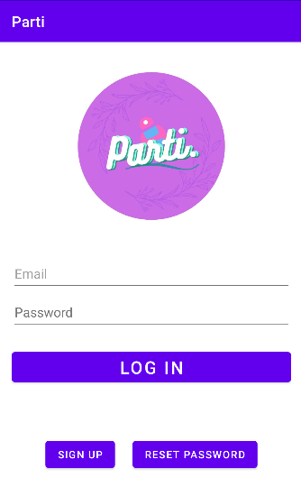

# Parti.
Main repository for team MetaNDroids (5174), Apollo 11, Orbital 2022
# Introduction
## Summary
**Parti.**, an Android-based app that allows users to participate in each other's projects.
## Motivation
It is pretty common that university students are required to do an individual/group project. It could be a software app, a survey, an experiment, etc. Whatever the project is, the fact is that participants **ARE NEEDED**, be they test users, surveyees, or experiment subjects! 

So often we see students posting their advertisements and invitations in random Telegram groups, on personal websites, or at bus stops, but very few really respond. As a result, a lot of Telegram groups, such as module discussion groups (the GEA1000 group is the worst) and interest groups, are full of spam. Personal websites end up having low views. Bulletin boards at bus stops are also messed up by an overwhelming number of posters. Other students are distracted and bothered, so they pay even less attention to such advertisements in the future. It is hard for initiators to find participants, and conversely, students who would like to participate in their peers’ works cannot find the projects which interest them. 

So what goes wrong? Why is it so hard for project developers to find other students to participate in their projects? We believe this is due to the following reasons:
1. The absence of **a platform that serves as a bridge or an agent between project developers and potential participants.** Information is not aggregated but instead, dispersed. Therefore, different project developers seek participants individually but do not have the opportunity to post their requests onto a shared public platform. Potential participants do not have enough information about what projects are ongoing and might interest them.
2. **The lack of a reward system** that really motivates people to participate.
3. Project developers only focus on their own projects, but **they can also be each other’s participants.** They are the ones who have the strongest incentive to participate in others’ projects, if other developers participate in theirs in return. However, there has yet to be a platform on which developers from different projects can collaborate.

Hence, we want to develop a solution to these three problems.

## Aims
* Build a **centralised platform** that serves as a bridge and an agent between project developers and potential participants. Information is to be aggregated and shared on it.
* Invite more users to use projects developed by students.
* Build a **mutually beneficial, collaborative** platform where project developers and researchers can participate in each other’s projects.
* Assist **research organisations and non-profit institutions** in recruiting volunteers for experiments/surveys/social work.
* Involve students in the process of **ranking/advertising** the projects of their peers, enabling them to support those projects that engage or benefit them.

## Scope
The target audience is all university / polytechnic students.
The platform **IS NOT**:
* A job market where people apply for jobs and internships
* A social networking platform
* A school forum where people talk about issues at university
	
The platform **DOES NOT**:
* Accept commercial entities to post their projects to seek more users for commercial / marketing purposes
* Tell the project developers how to improve their projects, such as debugging. They should make sure their projects work before they invite participants.

## User Stories 
The core of the mechanism is called the **Participation Point** system.
* As a project developer, I can use my Participation Points to **boost the ranking** of my project, so that more users on the platform can see it and participate in it.
* As a project developer, I can actively participate in other developers’ projects and **rank** a project and **provide feedback on it**, so that I can earn more Participation Points to support my project.
* As an ordinary student, I can earn Participation Points and **transfer** it to my friends, so that they can user it for their projects.
* As an ordinary student, I also **give constructive and critical feedback** and **donate** my Participation Points, so that I can endorse my favourite projects.

# Get Started
The application is a mobile app on the Android system, so to test it or use it, you need an Android environment. Please select one of the following methods to run the app, according to the device you have.

## Run the App on a Physical Android Smartphone
If you have a **physical** Android device, you may run the app on it.
* The Android SDK (Software Development Kit) version on your smartphone shall be at least **26**; otherwise, the application cannot run on it, and you have to choose another method to run the application. You can check the version by following the steps provided on this [website](https://its.uiowa.edu/support/article/2803).
* **The recommended SDK version is 32**.
* **The recommended screen size is 5 inches.** You can check your screen size following the instructions [here](https://www.samsung.com/uk/mobile-phone-buying-guide/what-screen-size/).

It is okay if your smartphone does not have the recommended version or screen size. The application should be able to run, but potentially with some **distorted or not-to-scale user interface.** 

* Now if you are sure that your smartphone can run the application, you may proceed to download the .apk file from [Google Drive](https://drive.google.com/file/d/1SV0ERNrYLtcERg7zPqiyn7yMf4wMekgh/view?usp=sharing) or [Github](https://github.com/Hongyi6328/MetaNDroids_Orbital2022/blob/main/Parti.apk). If Google Drive warns you that the file might contain malware, please ignore it. Our app is safe. As soon as you download it successfully, the Android system will automatically notify you to **install** the downloaded .apk file. In case you miss the notification or the system does not notify you, you can still install it manually.
* Open your file manager (the ‘Files’ application) and go to the **default download location of your system.** If you are not sure where it is, do check out this [link](https://www.androidpolice.com/how-to-find-downloads-on-your-android-phone/#:~:text=To%20quickly%20find%20where%20your,files%20in%20that%20specific%20folder).
* Click on Parti.apk and wait for the installation to complete.

If the installation is successful, Parti will appear in your main application menu with the logo , and you are ready to run it. Please read the next section on Using the App and Features.

## Run the App on Android Studio
If you do not have an Android smartphone or your smartphone does not meet the system requirement, you can also run the app on Android Studio.
* If you do not have **Android Studio** installed on your PC, please download it [here](https://developer.android.com/studio?gclid=CjwKCAjw5NqVBhAjEiwAeCa97XMhMTqyrDV9YNK6dB9iltn3hcKoH-V2i2pSwFSSBJMkxC1jpfOVLRoCJHcQAvD_BwE&gclsrc=aw.ds). Android Studio is compatible with **Windows, MacBook, Linux and Chrome OS.**

* Open Android Studio and click on the **‘Device Manager’** tab highlighted in yellow, which provides a variety of **Virtual Android Machines.** 

	

* Click on **‘Create device’.**

	

* Choose **Pixel 2** (preferably) or any hardware device you want.

	

* Choose **API Level at least 30.**

	

* Select **‘Portrait’** as the default orientation and click on **‘Finish’**. Android Studio will take some time to create the device. Android Studio, along with the virtual device, may occupy a lot of memory space on your PC, so please remember to remove it after testing the app.

* While you are waiting for the device to get ready, download the .apk file from [Google Drive](https://drive.google.com/file/d/1SV0ERNrYLtcERg7zPqiyn7yMf4wMekgh/view?usp=sharing) or [Github](https://github.com/Hongyi6328/MetaNDroids_Orbital2022/blob/main/Parti.apk). If Google Drive warns you that the file might contain malware, please ignore it. Our app is safe. It should be saved at the **default download location** on your PC, usually C:\user\downloads for Windows and Files/downloads for MacBook.

* After the device is created, simply **drag the Parti.apk** file to the screen of the device. The system will automatically install the file for you. If it does not, drag the file again, check the notification centre and the event log at the bottom right corner.

	

* Upon successful installation, click on the **dot at the bottom menu**, hold it, and move it up to raise the application menu. 

	

* Open .

Now you are ready to run it. Please read the next section on Using the App and Features.

## Run the App on an Online Android Emulator
You might not wish to download a big bundle of files solely to run a light app. An online Android emulator can be an alternative. You can use a variety of online emulators on the internet, but bear in mind that many of them are not safe and may contain inappropriate information, such as scams. We **do not** recommend you to use online emulators, but you are definitely free to do so. The procedures are basically the same as what you do to run the app on an Android Studio emulator.

# Basic Features
## Sign-up
The first page the app shows is the log-in page. If you do not have an account yet, kindly click on the 'Sign Up' button at the bottom left.


You will be redirected to the sign-up page. 

Enter your **REAL** email address and preferred password here. Please note that your password has to be at least **8 characters long with at least 1 uppercase letter, 1 special character, and 1 digit**, for account security. Also, make sure that the passwords you enter **match**. If any of the above two conditions are not met, you will fail to sign up and have to do it again.

The system will pop up a message  if you successfully create an account. Please remember your registered email and password. Now, the last thing to do before your account is ready is to verify your email. Go to your mailbox and **check your junk mail box if needed**, click on the verification link sent by the system to verify your account. During the process, please **do not navigate back to the log-in page**; otherwise you will need to go through the whole process from the start again. 

After you verify your email address, click on the "Confirm Verification" button, and you will be directed to the main page. If you do not receive a verification email, you can click on the "Resend Verification Email" button.

Since the development phase has concluded, your account will not be removed. Be sure to use our platform in the future.

## Log-in
You may already have an account in hand, and what you need to do is **sign in** to your account. 



On the first page, below the app logo, you can enter your account credentials to sing in. If you key in an email address that is not present in the database or a wrong password by mistake, you will get a message . Please double check your entries. If you forget your password, click on the **"Reset Password"** button at the bottom right and get **an email to reset it.** Successful log-in will render you another message .

**After some time of inactivity, you will be signed out.**

## Log-out
Upon successful log-in, if you have saved all changes and do not wish to stay logged in, you can log your account out by navigating to the **"My Profile"** tab, scrolling down to the very bottom, and clicking on the **"Log Out"** button. After doing so, another log-in operation is required to get back the access to your account.

## Navigate Between Views (Fragments)
In Android systems, a page that is designated for a particular purpose and integrated into the main container is called a **fragment.** There is a navigation bar at the bottom, which contains 3 items: “Browse Projects”, “Browse Users", and “My Profile”. You can navigate between them simply by clicking on the corresponding item. More about the 3 fragments will be discussed later.

## Browse Projects
The "Browse Projects" fragment is for you to browse projects.


The main data container is called a **Recycler View**, in which every item represents a project. As shown in the screenshot, each list item consists of the title, a short description, the average rating (from 0 to 5 inclusive), a horizontal bar indicating the progress, and a project image. You can scroll the list up and down.

There is a dropdown menu at the top of the view, in which you can **filter the projects** by some conditions. You may select the projects you posted only, or projects that you have participated in.

Not all information about the project is shown because the purpose of this fragment is only to provide you with brief outlines about projects. To take a deep look into a project, simply click on it and you will be navigated to another view.

## View Project Details
After clicking on a project in the "Browse Projects" fragment, an activity pops up and shows you **full details about that project**. You can also freely scroll the view up and down.


The details include its image with bigger size, its type (software app, survey, experiment or other), the full version of project description, and a rating bar displaying .

### Verification Codes
There is a section for your to enter verification code. **A verification code is used to confirm that a user really participated in a certain project.** A single "participation" is called an **action**. A user can take multiple **actions** for a project, each rewarding the user some **Participation Points**. For example, user A posts a software app on **Parti.**, and the system will send an email along with a list of available verification codes to A.  User B participates in A's project, so A gives one of the codes to B. The latter enters the code on the platform, so that the platform knows user B really participates and gives B the corresponding amount of **Participation Points.** Furthermore, A can invite B to participate in the project again if additional assistance needed. After that, B can enter another code to redeem the reward.

You may want to ask: Why cannot A just confirm on their side that B has participated in the project? Why do we have to deal with an ugly code? The answer is:
- For larger projects, it is very inefficient to manually confirm every action taken. People make mistakes, and our aim is to prevent people from doing so.
- A can hide the code somewhere in their project, and encourage B to find it themself. Hence, participation is no longer a formality but an in-depth experience.

**You cannot enter verification code for your own projects.**

More on verification code will be discussed later [here](#the-verification-code).

### Donations
You may donate PPs to a project to boost its ranking (dynamic and staic, which will be discussed [later](the-ranking-algorithm)). PPs will be deducted from your account balance, but it will not be transferred to the project host directly, because it is for the project in particular. In this sense, your donated PPs kind of "comes to void", however boosting the ranking as a gesture of support. The more you donate, the higher resulting ranking.

**You can donate PPs to your own projects.** Just make sure you have a **sufficient** amount.
 
Click on the ‘Back’ button at the top left to return to the main page.

### Comments
You can browse other participants' comments to get a bit of sense about a project, and decide on whether you want to participate or not. After you participate in a project, i.e., you have submitted at least one verification code, you can leave a comment on the project, talking about experience, further improvements etc. Note that rating matters in ranking the project. **We welcome constructive and critical feedback. Please be kind to others.**

For the sake of simplicity, a participant is allowed to leave one comment per project. If you take multiple actions, you can update your comment and rating later. Your previous comment will be pre-loaded for the ease of modification.

**You can also delete your comment. Whenever you have something to say, add a new one.**

## Create Your First Project
To create a project that belongs to you, click on the **"New Project"** button in the "Browse Projects" fragment. The view shown below will pop up.


**You can set the project image by simply clicking on the default info icon at the top.** You may also want to give a good name to your new project, and talk about what it is about and how to participate in the project description section. Finally, do not forget to set the number of actions you need and the reward for each action. The latter will affect the ranking of your project. **Higher Participation Point reward will definitely grab more people's attention.**

Make sure that you have sufficient PP balance to launch the project. Once the project is created, PPs for it will be deducted from your account and saved in a temporary deposit first, which is called the **"project balance"**. After a user redeems a verification code, the corresponding amount of PPs will be transferred from the balance to the user.

Click on the **"Submit"** button at the top right to submit this project. Upon successful submission, you will receive an email along with **a list of valid verification codes** for the project. **Manage them properly, and give them to your participants at the right time** (once you think that they completed an action). If you did not receive that email, click on the "Submit" button again. 

## Edit Your Projects
There is a need to manage and edit the projects you posted, too! In the **"View Project"** view, if you are the host of the project, the **"Edit"** button will be visible, hovering at the top right. Click on that to modify everything as if you are creating a new project, just with one slight difference -- **The number of actions needed cannot be smaller than the actual number of actions done.**

Remember the concept of **project balance** mentioned in the above section? This is helpful when we have to refund some PPs to you after editing. If you deposited more PPs previously than you need now, the additional part will be refunded to you immediately. Conversely, if the amount in the project balance is not enough, you need to pay more PPs now. So again, make sure you have sufficient amount.

If unfortunately, not enough actions have been taken and you have been waiting for so long, you can **get full refund by setting the number of actions needed to be equal to the actual number.**

## View and Update Account Details
In the **"My Profile"** fragment, you can view and update your account details, such as alias, year of matriculation and your major.


From the top to the bottom, the elements shown are your profile image, email, user ID and Participation Points (PPs). You can upload your custom profile image simply by clicking on it, and then, there will be a dialog for you to pick a photo from local storage. However, **you cannot change your registered email (at least for now), user ID and amount of PPs.** User ID cannot be changed because it is the key that uniquely defines a user account. Scroll down, and you can see more editable fields.

You can change and update them by clicking on the ‘Update’ button. Please note that some validation rules will be applied, such as no whitespaces in alias and length of self description no longer than 5000 characters. Data that do not pass validation will not be updated and you will be given respective instructions on how you can fix it.

## Search and View Other Users
You can explore what other users are doing and their interests. 
Click on the **"Browse Users"** tab in the main page, and you will see another RecyclerView, displaying all users. 


### Search
You may use the search bar at the top to search for a user by their alias. Note that the search results will **refresh every 0.75 seconds while you key in the input.** The system records timestamp of the last input event and compares it with the next input event. If the interval is greater than 0.75 seconds, then update the search results. Doing so makes it convenient to search, while ensuring the UI not jerky due to frequent refreshing.

### View a User
Click on a RecyclerView list item to take a closer look at a user. You can view their account details (of course you cannot change them), projects they posted, and projects they participated in.


### Transfer Participation Points
If you do not need participants at all, what is the point of using **Parti.**? Why earn so much PPs but not use it at all? The answer is that you can transfer PPs to your friends who need it! However, to make sure this feature is not abused, and to encourage users to earn PPs on their own, **a transfer rate of 0.9 applies.** As usual, make sure you have sufficient amount. **Upon successful transfer, the recipient will be notified via email.**

# Advanced Features
## The Ranking Algorithm
### Introduction
A ranking algorithm is used to evaluate the ranking of a project, which determines the order in which all projects are displayed. **A good ranking algorithm should seek a balance between popularity and time.** On one hand, projects that come later should have higher ranking than those that come earlier do; on the other hand, earlier projects might be more popular than later projects, and hence, have a higher ranking. A quandry is that new projects are fresh, not visited by too many people, so the sample size is too small for us to know its real popularity. Anyways, no matter how  a new project eventually turns out to be, we must give it a "temporarily exceptionally high" ranking and expose it to enough users first.

Among a bunch of prevailing ranking algorithms, we chose a simple [**"Vote and Decay"**](https://datagenetics.com/blog/october32018/index.html) algorithm, which fortunately, has good control of popularity and time. The key idea is that all user input, including participation, PP donation, and comment, is a "vote" to the project. You may  simply think a vote as **an instant boost of ranking.** However, such a boost will **decay over time and eventually take no effects.** A new project will be given **an intial vote to push it to a reasonably high place** in the project list. Then, its fate - remaining at the top or falling down all the way to the bottom - will totally depend on its own performance. 

For example, a new project is out, pushed to the top of list. However, not too many people are interested in it at the time, so it receives few votes. In a couple of days, it smoothly slips down to the bottom as its initial vote decays. Surprisingly, one day, a generous user donates an awful lot of Participation Points to it, which raises it to the top again. This time, many people see it,  participate in it, and leave positive comments, so it keeps being voted up, and the votes overcome the decay. As such, it remains at the top, and becomes one of the most popular projects for a long time.

As you can see in the above case, the "Vote and Decay" algorithm does a good job in taking care of popularity and time together.

### Mathematical Model
The key idea works, but it is still an idea. The implementation matters. There are many decay models, too. A classic yet simple model is called **Newton's Cooling**, or **Radioactive Decay.** The key idea is that the amount of decay at any moment is proportional to the remaining amount, which, in mathematical language, is written as


Where  _λ_ is a coefficient, _N_ the amount of vote, and _t_ the **temporal difference between the last update of decay and now.** After each evaluation, we also update the timestamp to be now.

This model elegantly solves a problem: since there are many votes, it is troublesome to calculate the decayed value of each vote and sum them up. A nice property of the model is that **the sum of decay is just the decay of sum**, so we can keep track of only one value. The model is time-context-independent, which means we do not care whether the amount was 200 recorded yesterday or 400 the day before. As long as the current amount is 100, we know it is going to be 50 tomorrow.

Upon a new vote, we update the current ranking and then, simply add the value of the vote to the total ranking. The new vote will decay with the remaining sum of previous votes **in the same rate.**

Another problem is the choice of  _λ_, which controls the speed in which ranking decays. It cannot be too fast; otherwise all projects will end up having a ranking around zero very soon. It cannot be too slow either; otherwise the relative trend between projects is not obvious. Either case will render projects not comparable. The choice of _λ_ has something to do with the typical recruitment period of a project. After some testing, we found that 10 days would be a good choice. **We expect a new project to decay to 10% of its initial vote after 10 days if there are no subsequent votes.** Let us talk about time in minutes. Then, 


### Variation
Everything seems good so far. Nonetheless, we still found the algorithm not very ideal, because most projects will end eventually, and at that time, they all have their rankings decay to around zero. **How can we distinguish projects that used to be popular from others?** Users may want to review past projects, but they will probably find all past projects jumbled at the bottom of list. Ordering by ranking does not work in this case.

Therefore, we proposed our own variation of the algorithm. The actual ranking of a projects is now **the sum of two components: one dynamic, and the other static.** The dynamic component decays over time, but the static component does not. A vote also has such two components. For a vote, **the dynamic part is typically 10 times the static part such that within a short time after the vote, the dynamic part dominates, but after a critical point, the static part dominates.**

With this variation, we can order old projects by their static ranking even after their dynamic ranking has already decayed to zero.

### Implementation


```Java
public static final double ACTION_DYNAMIC_VOTE = 100;  
public static final double ACTION_STATIC_VOTE = 10;  
public static final double COMMENT_DYNAMIC_VOTE = 150; //a comment is worth a higher vote
public static final double COMMENT_STATIC_VOTE = 15;  
public static final double DONATION_DYNAMIC_VOTE = 10;  
public static final double DONATION_STATIC_VOTE = 1;  
public static final double LAMBDA = 0.2303 / 60 / 24;

//Determine the vote by rating given, low rating give a negative vote.
public static double commentDynamicVote(int rating) {  
    return COMMENT_DYNAMIC_VOTE * (rating - 2);  
}  
  
public static double commentStaticVote(int rating) {  
    return COMMENT_STATIC_VOTE * (rating - 2);  
}  

//Determine the vote by the amount of donated PPs
public static double donationDynamicVote(double amount) {  
    return DONATION_DYNAMIC_VOTE * amount;  
}  
  
public static double donationStaticVote(double amount) {  
    return DONATION_STATIC_VOTE * amount;  
}

//The main logic to calculate the ranking
private void calculateRanking(double dynamicVote, double staticVote) {  
    ZonedDateTime now = ZonedDateTime.now();
    ZonedDateTime previous = ZonedDateTime.parse(lastUpdateDate,Parti.STANDARD_DATE_TIME_FORMAT); //The timestamp of the last update of ranking
    dynamicRanking = decay(dynamicRanking, previous, now) + dynamicVote; //The new dynamic ranking equals the decayed previous dynamic ranking plus the new vote
    staticRanking += staticVote;
    ranking = dynamicRanking + staticRanking;
    setLastUpdateDate(now.format(Parti.STANDARD_DATE_TIME_FORMAT));
}  
  
private double decay(double amount, ZonedDateTime earlier, ZonedDateTime later) {
	long diff = ChronoUnit.MINUTES.between(earlier, later); //The chronological difference between two timestamps
	return amount * Math.exp(-LAMBDA * diff); //The decay function
}
```

## The Verification Code
### Code Generation
As mentioned above, **A verification code is used to confirm that a user really participated in a certain project.** **As such, it has to be unique, identifiable, un-recyclable, complex enough yet not too long.** It must be unique, because one code associates with one single action. After  users submit a code, it is called **"redeemed"** and cannot be redeemed again, but it should still remain in the database as a record. The reason we want it to be complex enough is that we do not want users to predict it easily by experimenting the pattern. We definitely cannot simply generate codes from "000000" to "999999" and send them to users; otherwise users would abuse this function. Therefore, it must look like a random string such as "oJ2f9ag4H". Yet it is not real random. If we do generate codes using a real random algorithm, **we will end up with clashes one day,** and more importantly, the cost to handle clashes for each new code is too high.

How can we generate unique, complex codes? The answer is **pseudo-random!** Firestore database employs this algorithm to generate IDs for documents. The IDs are 28 characters long, containing uppercase and lowercase letters and 10 numbers, so there are 62 ^ 28 combinations in total. **Each combination is equally likely to be generated, but the algorithm was design in such a way that in a loop of 62 ^ 28 operations, all combinations will be iterated exactly once.** We utilised this feature as a workaround. Suppose we now need a verification instantly, what the system will do is send a request to the remote database asking for the next available document ID in a collection, let it be the code, and save the code in the collection with that ID, so that next time another different document ID will be given. 

### Data Model
A side effect of the above implementation is that all codes are stored in the same collection despite associated with different projects, but it is unnessary to create a collection for each project just to differentiate which code belongs to which project. Doing so will mess up our database paths. **Our solution is to keep two copies of each verification code.** For example, look at the data organisation below: 
| Collection | Document | Field
| ---------- | -------- | -----
| code_bundles | bundle1 | array: [code1, code2]
| code_bundles | bundle2 | array: [code3]
| code_bundles | bundle3 | array: [code4, code5]
| ... | ... | ...
| code_id | code1, code2, code3, code4, code5

There are two collections. `code_id` is only used to generate new code, and we never read anything from it. `code_bundles` consists of so called **"Verification Code Bundles"**, which, in other words, are sets of codes that are associated with different projects. The bundles have exactly the same document ID as their associated projects. For example, when we need to query the status of `code1`, we go to `code_bundles/projectId1/code1`. Note that in `code_id`, `code1` is just a string, but in `code_bundles`, it is an object. Its data dictionaray is [here](verification-code).

### Status of a Verification Code
Now let us talk about why we need a verification code bundle here. It is also **an object that stores a list of verification codes and other information.** More details [here](verification-code-bundle) 

**The problem is that project developers may change the number of actions needed.** If they increase that number, we need to add more codes, which is easy. Just use the above algorithm. However, if they decrease that number, things become complicated. It is common practice that we do not delete a document unless very necessary. Deletions bring side effects. For instance, it is hard to analyse a bug that is related to a deleted document. **The solution is to add a status marker, which indicates whether the code is redeemed, redeemable, or unavailable.** To decrease the number of actions needed, we simply set some of redeemable codes to be unavailable. Users will be prompted if they enter these unavailable codes.

Things become more complicated if a decrease is followed by an increase. We check whether the number of unavailable codes is enough. If yes, then turn some of them to be redeemable. If not, turn all of them to be redeemable, and create more codes.

**Verification Code Bundles help us handle such operations.**

Every time there is a change of number of actions needed, an email will be sent. **Attached to it is a list of all redeemable codes.**

## The Email Service
Users will receive a system email on the following occasions:
1. A verification email upon successful sign-up.
2. A reset email if password forgotten.
3. A list of redeemable codes after changing the number of actions needed.
4. A confirmation email when another user transferred some PPs to the user.

The first two services are provided by Firebase. We just invoke the corresponding methods when needed.
We employed **Trigger Email** and **SendGrid** to implement the last two feautres. More details [here](tech-stacks)

When we need to composse an email, we pack the fields in an Email object and upload it to a collection in the Firestore database. After some time, **Trigger Email** will read this object and convert it to a real email token and send it to **SendGrid** by our private key in **SMTPS (Simple Mail Transfer Protocol)** through **port: 465**. We saved an email sender on **SendGrid** in advance, so it uses the sender to send the email to the recipient. The sender address is sysadmparti@gmail.com. 

However, all emails sent as such will be tagged as "via SendGrid", which is highly likely to be recognised as a junk mail or spam, because indeed, many people abuse SendGrid to spam. So do check out your junk mail box frequently.
# Software Engineering Practices

## Use Case Diagram


## Architecture Diagram


## Data Dictionary

### User
| Field | Data Type | Size | Remark |
| ----- | --------- | ---- | ------ |
| uuid | String | 28 characters | The primary key. The ID that uniquely defines a user and never changes after registration.
| email | String |  | For authentication and security purposes.
| alias | String | Up to 20 characters | User defined alias/nickname, which can be modified for as many times as the user.
| profileImageId | String | 28 characters | The ID of profile image saved in Firebase Storage.
| participationPoints | double | 8 bytes | Earn PPs by participating in others' projects. Spend PPs by donating or calling for participants.
| projectPosted | List\<String\> | 28 characters each entry | The ID of projects posted by this user.
| projectsParticipated | List\<String\> | 28 characters each entry | The ID of projects this user participated in.
| major | Enum |  | The major this user is in.
| yearOfMatric | String | 4 characters | Year of matriculation.
| selfDescription | String | Up to 5000 characters | A short paragraph of to introduce youself.
| commentsPosted | List\<String\> | 28 characters | The ID of projects commented by this user.
| participationPointsEarned | Map\<String, Double\> | \<28 characters, 8 bytes\> | A map that keeps track of PPs earned from projects respectively.

### Project
| Field | Data Type | Size | Remark |
| ----- | --------- | ---- | ------ |
| projectId | String | 28 characters | The primary key. The ID that uniquely defines a project and never changes after posting.
| name | String | Up to 100 characters | User-defined title, can be changed many times.
| projectType | Enum | | Software application, survey, experiment and other.
| concluded | boolean | 1 bit | Whether participants are still needed.
| admin | String | 28 characters | The poster of this project, which is the only person that can add/remove a developer.
| developers | List\<String\> | 28 characters each entry | Collaborators of the project.
| participants | List\<String\> | 28 characters each entry | Participants of the project.
| numActions | int | 4 bytes | The number of actions done for this project.
| numActionsNeeded | int | 4 bytes | The expected number of actions done.
| numParticipants | int | 4 bytes | The number of participants in this project so far.
| numParticipantsNeeded | int | 4 bytes | The expected number of participants.
| ranking | double | 8 bytes | The ranking of this project, used to sort projects.
| dynamicRanking | double | 8 bytes | The dynamic component of ranking.
| staticRanking | double | 8 bytes | The static component of ranking.
| description | String | Unlimited | A short paragraph that describes what the project is about and how to participate.
| comments | List of String | 28 characters each entry | The ID of comment posters.
| numComments | int | 4 bytes | The number of comments so far.
| totalRating | long | 8 bytes | The total rating of comments.
| lastUpdateDate | String | 24 characters | The latest timestamp when the ranking is updated, using the pattern "yyyy-MM-dd HH:mm:ssZ" with [DateTimeFormatter](https://docs.oracle.com/javase/8/docs/api/java/time/format/DateTimeFormatter.html).
| imageId | String | 28 characters | The ID of project image saved in Firebase Storage.
| participationPoints | double | 8 bytes | The amount of PPs that will be given to prospective participants.
| participationPointsBalance | double | 8 bytes | The amount of PPs deposited in the project (unspent PPs).
| donatedParticipationPoints | double | 8 bytes | The cumulated amount of PPs donated by users, used to calculate the ranking.
| donors | Map\<String, Double\> | 8 bytes each entry | A breakdown of donors and their respective amount of donated PPs.

### Comment
| Field | Data Type | Size | Remark |
| ----- | --------- | ---- | ------ |
| senderId | String | 28 characters | The ID of the commenter.
| comment | String | 2000 characters | The body of the comment.
| rating | int | 4 bytes | From 0 to 5 inclusive, a higher number means more postive feedback.
| lastUpdateDate | String | 24 characters | The latest timestamp when the comment is updated, using the pattern "yyyy-MM-dd HH:mm:ssZ" with [DateTimeFormatter](https://docs.oracle.com/javase/8/docs/api/java/time/format/DateTimeFormatter.html). Used to calculate ranking.

### Verification Code
| Field | Data Type | Size | Remark |
| ----- | --------- | ---- | ------ |
| code | String | 28 characters | The actual code, no duplicates.
| participant | String | 28 characters | The ID of the user who redeemed the code.
| participationPoints | double | 8 bytes | The amount of PPs this code is worth.
| redeemed | boolean | 1 bit | True **iff** the code if redeemed already.
| redeemable | boolean | 1 bit | True **iff** the code is **NOT** redeemed **AND** the code is available.

### Verification Code Bundle
| Field | Data Type | Size | Remark |
| ----- | --------- | ---- | ------ |
| projectId | String | 28 characters | The project associated with this bundle.
| numRedeemed | int | 4 bytes | The number of redeemed codes in this bundle.
| numRedeemable | int | 4 bytes | The number of codes that can be redeemed now.
| verificationCodeList | List of Verification Code |  | A list of codes associated with the project.

## Conventions
**We adhered to naming and coding conventions strictly.**
In a typical Java class, the code should be organised in this order:
* Nested classes and enums.
* Public static constants.
* Private static constants.
* Class variables
* Public methods that override their parents' methods, such as onCreate() and onStart().
* Private helper methods that are called by the public methods to do a specific task.

A good point of doing so is that **methods like onCreate() only specify the overall workflow after an event is triggered, and the helper methods do the actual tasks.** For example,
```Java
@Override
protected void onCreate(Bundle savedInstanceState) {
	super.onCreate(savedInstanceState);  
 
	activityViewProjectBinding = ActivityViewProjectBinding.inflate(getLayoutInflater());  			
	setContentView(activityViewProjectBinding.getRoot());  

	// private helper methods
	checkParticipationStatus();
	setUpCommentRecyclerView();
	downloadVerificationCodeBundle();
}
```
We employed the **camelCase** naming convention for variables in source code. We do not mind if the length of variable names is too long, because the IDE has very powerful auto-complete function. More importantly, we want to make variable names as specific as possible to avoid ambiguity. 
```Java
ActivityViewProjectBinding activityViewProjectBinding; // preferred  
ActivityViewProjectBinding binding; // unclear
```

For UI components, we adopted the **snake_case** naming convention. The format is `<type>_<location>_<name>`. For example, a spinner that displays a user's year of matriculation in the "User Profile" fragment is named as `header_user_profile_year_of_matric`.

Sticking to naming conventions helps us organise and manage our code more efficiently. It is less likely for us to have name clashes.

## Tech Stacks
* **Java**

	Java is the **fundamental programming language** in which Android is built. Being familiar with Java is essential to start the project.

* **Android Studio and Android SDK**

	Android Studio is the **official IDE** for Android development. The main part of the work will be done in Android Studio for Windows. Android SDK is a collection of **original libraries, configurations, documentation and tutorials** that will aid us in getting acquainted with Android development quickly. The built-in libraries are also effective and efficient for us to complete common tasks, such as basic security configuration, running environment setup, and device compatibility check. **Java files written with Android Studio and Android SDK control the UI logic.**

* **AndroidX UI**

	A library with a wide variety of ready-to-use frontend UI components, such as icons, buttons, and forms. **It is used for interface design.**

* **Firebase Firestore and Firebase Storage**

	Firebase is a platform developed by Google for creating mobile and web applications. It is now their flagship offering for app development. It serves as a remote data storage and BaaS (Backend-as-a-Service) server, using which does not require too much coding at the backend. **Firestore stores plain data**, such as string, number, and boolean, while **Storage stores files**, such as images.

* **Firebase Android SDK and BoM (Bill of Materials)**

	Firebase Android SDK provides a lot of Android **plug-in libraries that facilitate database-related operations**, such as asynchronous data retrieval, which will be discussed later in the report. These operations are hard to implement without the support of Firebase Android SDK. The Firebase Android BoM (Bill of Materials) enables the developer to **manage all Firebase library versions by specifying only one version** — the BoM's version. When the developer uses the Firebase BoM in the app, the BoM automatically pulls in the individual library versions mapped to BoM's version. All the individual library versions will be compatible.

* **Firebase Trigger Email Extension and SendGrid**

	**Trigger Email** is a **Firebase Extension** that listens to new documents in a designated collection, converts them to emails, and direct them to an email server via **SMTP (Simple Mail Transfer Protocol)**. SendGrid (also known as Twilio SendGrid) is a Denver, Colorado-based customer communication platform for transactional and marketing email. It serves as an email distributor and monitor, by using which developers can **update users upon account changes via email** automatically.

# Design Decisions

In this section we discuss **how the above-mentioned features were implemented** and **what the mental process behind the development was**. We try to answer the following questions: Why did we choose this development paradigm? Why did we prefer some tools over others? What were the trade-offs? What ideas did we come up with?

## UI Components and Layouts

We used components in the Standard Android Design Toolkit. They are icons, buttons, RadioButtons, CheckBoxes, ScrollView, RecyclerView, and TextBoxes, which are sufficient for basic data presentation and interactive operations. We tried to stick to **RecyclerView** as much as possible because it has notably better system resource usage and response speed due to **lazy loading and recycling.** To prevent layouts and images from being distorted and not-to-scale on hardware with different sizes, **constraint layouts and vector graphics are preferred.** Constraint layouts specify the position of each component by their relative positions, so that they are more flexible to different screen sizes and user settings. **Android fragments** are another considerable option to replace the traditional layout paradigm. They have fewer nested layers and hence, higher response speed. However, fragments are more difficult to implement. **Whether to use constraint layouts or fragments depends on how many nested layers there might be.** If there are a few, then constraint layouts are more suitable; otherwise, fragments. Similar to constraint layouts and fragments, vector graphics can easily adjust to different screen sizes without losing resolution, because they are not defined pixel by pixel, hence not affected by the dpi (dots per inch) number.

## UI Control

How components respond to user inputs, including but not limited to pressing a button, scrolling, zooming in/out, typing, deleting and navigating between pages will be controlled by Java codes. **We prefer Java over Kotlin** because the former, which we are more acquainted with, is compatible with more libraries and has a larger developer community. Android task and activity control is also an issue. Our tentative approach is **the standard launch mode** instead of others, such as the SingleTop mode and the SingleTask mode. The reason for this decision is that the standard mode has a clearer chain of operations (for example, pause A -> create B -> start B -> resume B -> stop A). More messy chains of operations are more troublesome to handle, easier to implement incompletely and incorrectly, and more prone to errors.

## Singleton and Data Binding

In object-oriented programming and software engineering practices, **the singleton design pattern refers to using only one instance of a class.** In other words, the whole class is written for one single use. Singletons are very common in Android development. For example, at any moment we only need one instance of the main activity class, because only one page shows on the screen, at the top of the activity stack. Thus, we say that we use the main activity as a singleton. A good point of using singleton is that it prevents over-instantiating unnecessary instances that do the same thing, which is a waste of system resources. Singleton is also convenient for navigation. For example: The 3 fragments are only instantiated once upon the start of the application and then referenced by the fragment manager. Throughout the whole life cycle of the application, the fragment manager only controls the navigation between these 3 fragment instances, which is **far more efficient than creating a new fragment every time the user switches to another page.** In the past, developers liked using the replace() method instead of hide() and show(). This method creates one more instance of the fragment every time it is invoked, which violates the singleton principle.

```Java
// Use the fragments as a singleton
browseProjectsFragment = new BrowseProjectsFragment();  
browseUsersFragment = new BrowseUsersFragment();  
userProfileFragment = new UserProfileFragment();  

activityMainBinding.bottomNavigationViewMain.setOnItemSelectedListener(item -> {  
	FragmentManager fragmentManager = getSupportFragmentManager();
	switch (item.getItemId()) {  
		case (R.id.action_browse_projects):  
		    fragmentManager.beginTransaction()  
	                    .show(browseProjectsFragment)  
	                    .hide(browseUsersFragment)  
	                    .hide(userProfileFragment)  
	                    .commit();  
			break; 
		case (R.id.action_browse_users):  
		    fragmentManager.beginTransaction()  
	                    .hide(browseProjectsFragment)  
	                    .show(browseUsersFragment)  
	                    .hide(userProfileFragment)  
	                    .commit();  
			 break; 
		case (R.id.action_my_profile):  
			fragmentManager.beginTransaction()  
	                    .hide(browseProjectsFragment)  
	                    .hide(browseUsersFragment)  
	                    .show(userProfileFragment)  
	                    .commit();  
			 break; 
		default:  
	         break;  
	}  
```

In the later versions of Android SDK, **data binding was introduced to further facilitate use of singleton.** **Android data binding refers to the one-to-one pairing between the UI component and the instance in Java/Kotlin code.**

```Java
// In the past:  
BottomNavigationView navView = findViewById(R.id.bottom_navigation_view_main);  
// Now:  
BottomNavigationView navView = activityMainBinding.bottomNavigationViewMain;
```
In the past, Android developers could only use the findViewById() method to get the reference of a UI component, but this method can be invoked outside of the component’s associated activity. Now, with the aid of data binding, we associate the component to an instance of the activity. As such, cross-referencing is avoided. So far, we have stuck to singleton as much as we can.

## Firebase vs. Supabase

At first we planned to use Supabase as our backend database. However, after doing some research, we found that **the supporting Java library for Supabase is still under development** and may not be that compatible as compared to other languages. Then we decided to migrate the database from Supabase to Firebase, which was a waste of time due to the lack of pre-development research. Anyways, Firebase is indeed more powerful for Android development.

Both Firebase and the Android system are products of Google. The company seems to have endeavored to integrate them. **There are a lot of libraries, supporting classes, and APIs that can be used out of the box.** The programming paradigm is also more declarative, so we did not need to take too much care of the complicated processes behind a simple instruction.

A trade-off was that some advanced features of Firebase are not free. Considering that our project’s data traffic is relatively low and that basic features suffice for our proposed needs, the cost is very low even we enabled an external extension, Trigger Email . In addition, Firebase is a schemaless database, which means it would be more tedious to manually add data. But in the production environment all data is added automatically. Hence, that trade-offs were acceptable.

## Firestore Database vs. Realtime Database vs. Cloud Storage

Firebase has 3 brands of database, **Firestore Database, Realtime Database, and Cloud Storage.** We chose to save plain data, such as strings and numbers, on Firestore, and files, such as images, on Cloud Storage which is the only database that supports files. A quotation from the Firebase official [website](https://firebase.google.com/docs/database/rtdb-vs-firestore):

>Cloud Firestore is Firebase's newest database for mobile app development. It builds on the successes of the Realtime Database with a new, more intuitive data model. Cloud Firestore also features richer, faster queries and scales further than the Realtime Database.

>Realtime Database is Firebase's original database. It's an efficient, low-latency solution for mobile apps that require synced states across clients in real time.

The reason we picked Firestore was that it is more suitable for mobile app development and that we would not use too many realtime features of Realtime Databse, because the application does not need too many data update operations.

## Asynchronous Data Retrieval and Firebase-Compatible Classes

As many other contemporary databases, data retrieval operations on Firebase are done in an **asynchronous manner** not to delay the main thread. This makes a lot of Android built-in classes and templates not working any more. For example, to display the title of a particular project, a traditional synchronous approach is:

```Java
FirebaseFirestore firebaseFirestore = FirebaseFirestore.getInstance();  
String name =  
        firebaseFirestore  
                .collection(Parti.PROJECT_COLLECTION_PATH)  
                .document(projectId)  
                .get()  
                .getResult()  
                .getString(Project.NAME_FIELD);  
activityViewProjectBinding.inputViewProjectTitle.setText(name);
```

However, **such code definitely does not work properly with Firebase**, because the document is obtained before the application really receives data from the remote server. As a result, the string ‘name’ is still empty.

We had to abandon some classes, such as the BrowseProjectsRecyclerViewListAdapter, for not being asynchronous. To be genuinely asynchronous, we learnt about how Google developers wrote their supporting classes in their [sample projects](https://github.com/firebase/quickstart-android/). However, we found that these sample classes are, indeed genuinely asynchronous, but do not listen to realtime data changes. This triggered a bug, which took us 10+ hours. Finally, the correct solution is the [**Firebase UI Package**](https://github.com/firebase/firebaseui-android). We made our own Firebase-compatible classes, such as the ProjectsRecyclerAdapter and ProjectHolder to replace the old classes. The correct approach is **Query and Listener**, which can be used as a callback when the data changes.

```Java
// A typical workflow of setting a RecyclerView adapter that queries Firestore data and listens to data changes
Query = FirebaseFirestore
		.getInstance()
		.collection(Parti.PROJECT_COLLECTION_PATH)  
        .orderBy(Project.RANKING_FIELD, Query.Direction.DESCENDING);
FirestoreRecyclerOptions<Project> firestoreRecyclerOptions = new FirestoreRecyclerOptions.Builder<Project>()  
        .setQuery(query, Project.class)  
        .setLifecycleOwner(this) // The adapter keeps listening to data changes through the lifecycle of 'this' activity.
        .build();  
return new ProjectRecyclerAdapter(  
        firestoreRecyclerOptions,  
		filterActionable,  
		user.getUuid());
```

## Security

We adopted the **Row Level Security (RLS) policy.** There are three scenarios we need to consider: select, insert and delete.

-   **Select**

	1.  **Visible to all users:** uuid, username, profile image, participation points, email, major, year of matric, self description, projects posted, projects participated, and all fields in the project table.
	2.  **Not even visible to the user:** password (for security considerations)

-   **Insert**

	3.  **Row level security policy will be applied.** Only the user can edit / insert their data entries.
	4.  Only the developers of a project can edit / insert its data entries.

-   **Delete**
    
    5.  We are very careful with deletion of a user profile or a project. We encourage users not to delete a project unless there are sufficient reasons, because we may lose track of Participation Points if we delete a project. Therefore, if project developers want to remove their projects from our platform, they must apply for it, and we will grant the authorisation on a case-by-case basis.

**Users are strongly encouraged to set passwords complex enough.** **They need to be at least 8 characters long and a mix of uppercase and lowercase letters, numbers, and special characters.** Passwords will not be stored directly in plain text in the database. We simply employed the FirebaseAuth class provided by Firebase instead of industry-standard asymmetric encryption algorithms to encrypt the plain test and save it in our database. We are not skilled enough to make sure that our encryption implementation is definitely secure, so it is better to use existing tools. On each login request, only if the encrypted text of the entered password matches the one in our database, the user will be authenticated and allowed to view their profile.

## FragmentContainerView vs. NavigationHostFragment

**Both FragmentContainerView and NavigationHostFragment are used to host a fragment inside an activity so that users can navigate between the fragments without leaving the wrapping activity.** This reduces the overhead cost when creating new activities. Despite the fact that FragmentContainerView was released in a later version of Android SDK and is the officially recommended host view, we met a lot of problems when we used it. We even downloaded a [sample project](https://github.com/android/animation-samples/tree/main/ActivitySceneTransitionBasic), which also utilised FragmentContainerView, compared our configuration with its line by line, and found no differences. However, bugs due to it still occurred for unknown reasons. We had to convert the view to NavigationHostFragment. Outdated though, a good point about the latter is that it requires a **NavigationGraph** that provides a clearer mental model about the relationships between the fragments.


# Testing and Evaluation
## Unit and Integration Testing
To keep this site simple, [**the test cases are in a separate document here**](https://docs.google.com/document/d/1NnRGz3P7MCb4G6tfcOtHmAwunKXecytJf6TErLwXCNs/edit?usp=sharing). The list is not exhaustive. Many test cases are not included here.
Up to now, all trivial bugs have been fixed, so that the normal operation and running of the app should be robust and reliable. **We also covered some extreme cases**, such as the internal process of a verification code bundle after decreasing then increasing the number of actions needed for a project. However, due to time contraints, we were not able to test all extreme cases. It is possible that after some time of using, a hidden problem surfaced. Given the current complexity of the app, plus our data protection measures implemented in advance, it is relatively easy to remedy any critical bug and recover data affected, even manually.

## User Testing
Thanks to Li Borui, Li Siqi, and Zhao Luotong for testing the app. The list is not exhaustive.
| Feedback | Response |
| ------------ | -------- |
| The Toast messages did not fully show up. | After doing some research online, we found that what we could do about that was very limited. **Toast is a system-managed interface for which different brands have difference implementations.** It seems that splitting the text into multiple lines might help in some cases, which we did.
| Only a few characters counted as special characters in password. | Our regex pattern did not match most of commonly used special characters. We updated the pattern so that **all non-word characters should count as a special character.**
|The UI of the log-in page did not look very beautiful. It is better to show the app logo here. | Added.
| Sometimes the texts exceeded the screen, and some words were not fully displayed. | We added a **margin** for each constraint to make sure every view is some distance from the edges.
| The auto placeholder for an empty project comment was some random text. | We originally set the **hint** of comments to be the default comment text. However, the comment had a non-empty **text** by default. When there was a text in presence, the hint would not show up. Now we set the **text** to be the placeholder directly.
| The app was jerky for a short period of time, acceptable. | This should have something to do with **multithreading**, which we will work on in the next phase.
| It would be better if I could search for a project and sort projects by different orders. | We will work on that.
| It was sometimes confusing that I did not know which TextViews were editable and which were not. | We improved the UI to give more contrast between editable and un-editable TextViews. **Their fonts, text sizes, and colors are different now.**
| If I click the system-level "Back" button instead of the one in the app, a blank page appeared. | We do not know the cause yet. This problem happens on our test emulators as well. We will take a look into it.

### Other comments
* The functionality of the app was excellent. There were no critical bugs that lead to shutdown, crashes, or inactivity encountered.
* The general idea of this project is novel and engaging.

## Bugs
This is a non-exhaustive list of bugs interesting enough for us to discuss.
| Bugs | Causes | Fixes |
| ------ | -------- | ----- |
| The app cannot inflate the fragmentContainerView in the main activity. | A "damaged" CoordinateLayout + failed Java default class constructor + missing references in the data binding of the main activity. | Converted the CoordinateLayout to a new ConstraintLayout. Created public empty fragment constructor. Imported correct binding class.
| build.gradle "cannot resolve repos" | Unknown | Cleaned the project and invalidated all caches.
| Firestore "fail to convert data type to custom class" | Something wrong on the Firestore side. **Firestore did not recognise manually changed data types at backend.** The recorded types were still the ones before the change. | Removed all documents and built a new collection programmatically.
| FragmentContainerView failed to do fragment transaction | Unknown | Converted FragmentContainerView to NavHostFragment
| After decreasing the number of actions needed, some verification codes should become unavailable, but they did not change. | We did not update the verification code bundle of an existing project. | Added the missing logic.
| When we navigated back to the "View Project" activity after editing. Changes were not displayed. | **Android bundles only pass by value,** so modifying the project object in the “Edit Project” activity does not affect the project object in the "View Project" activity though the changes are really uploaded to Firebase. | Replaced startActivity() with startActivityForResult() in the "View Project" activity, and created a setResult() method in the "Edit Project" activity to return the instance of the project from the "Edit Project" activity.
| Comment RecyclerView list was not showing. However, the same adapter worked in a fragment but did work properly in an activity. After debugging, we found that it was not firebase's fault, because data was actually loaded. It was not something wrong with the RecyclerView list, because another hard-coded adapter works. The faulty adapter had a lot of weird behaviours, such as sudden change of item titles in the list. After taking a look into the source code, we found that **getItemCount() always returned 0, so the list did not get updated.** | At first we thought the cause was that faulty RecyclerView list was nested inside a ScrollView. The actual cause was a simplified adapter that did not really listen to data change in real time. | Updated the adapter modified from the Firebase UI library that establishes a stable connection with the remote server.
| Sometimes the RecyclerView adapter tried to access an empty position in the list, causing an IndexOutOfBoundException. | This is an infamous Android primitive bug caused by **the faulty default LinearLayoutManager that has not been fixed yet.** We could only do a workaround. | We created a wrapper that inherits the system's LinearLayoutManager to catch the exception. This approach seems to bring no side effects so far, but the app still crashes sometimes after fixing it. More actions needed in the future.
| A button was not clickable. | This button overlapped with an ImageView, which took its touching area. | Changed the z-translation of the button so that it floats on the ImageView, regaining its touching area.

**Minor bugs are not included here.**

# Conclusion
We spent much time doing trial-and-error with new tools/libraries/tech stacks that we were not familiar with. Some bugs also took us tens of hours. However, we believe the time “wasted” was indeed a necessary overhead cost at early stages of development. As we got more acquainted with the paradigms/tools we used, we progressed faster and faster.

Up to now, we have learnt about how an Android app is organised and structured, what the fundamental components are, what the correct implementation should be, etc. We turned the theories we learnt into practices. The data structures we learnt in CS2040S were exceptionally helpful. When to use a map? When to use a list? In the past we might not only have vague answers to such questions, but after developing this project, our thoughts were verified by practices, hence we became more confident to choose, modify, and employ those data structures to solve a bigger problem.

We understood that in real world there are no model answers. Software engineering is about balancing factors. Functionality, performance, maintainability, extendability, compatibility, user experience, appearance..., these factors play a critical role when we make decisions. Sometimes we need to sacrifice one in exchange for another; sometimes we need to achieve one before we pursue another. Anyways, no matter how we weight these factors, it is always imperative to stick to good practices, keep the code clean and concise. The cost of hard-coding and abusing shortcuts might not be obvious at the time we use them, but it will come one day.

We also found that software engineering is far more than mere coding. Code, programming languages, libraries, and frameworks are only the tools for us to implement our ideas. More important is that we need to think in depth before we proceed to implement our ideas. We need to have a very clear mental model about what our product shall look like. A bad design at the first place would never produce a good final product. After implementation, documentation is equally important in the sense that it determines whether it is easy for us to implement more ideas based on our current product.

We believe this valuable knowledge and experience can equip us to go further on our journey of software development.

# Remarks
## Dropped Features

- We dropped the questionnaire feature specified in our Milestone 1 report because:

    1.  Questionnaires can be in very different formats, which are really hard to store in one single collection while maintaining the integrity of them.
    2.  There are a lot of popular questionnaire / survey platforms. We prefer not to reinvent the wheel.
    3.  As our peers pointed out in the first round of peer evaluation, privacy might be an issue when people try to collect information on our platform. We have no experience in dealing with privacy issues and are not willing to get involved in legal affairs.
    4.  We believe the rest of features can still secure us the proposed level of achievement.

## Acknowledgement
### Contributors
- **Design**: Huang Hongyi [@Hongyi6328](https://github.com/Hongyi6328)
- **Coding**: Huang Hongyi [@Hongyi6328](https://github.com/Hongyi6328)
- **Testing**: Huang Hongyi [@Hongyi6328](https://github.com/Hongyi6328)
- **Project Report**: Huang Hongyi [@Hongyi6328](https://github.com/Hongyi6328)
- **Project Poster**: Huang Hongyi [@Hongyi6328](https://github.com/Hongyi6328)
- **Project Video**: Huang Hongyi [@Hongyi6328](https://github.com/Hongyi6328)
- **Test Users**: Li Borui, Li Siqi, Zhao Luotong

### Resources Used
- [**Firebase UI**](https://github.com/firebase/firebaseui-android)
- [**Material Design**](https://material.io/)
- [**Canva**](https://www.canva.com/)
- [**Google Fonts**](https://fonts.google.com/icons)

All resources are used under the [ Apache License Version 2.0](https://www.apache.org/licenses/LICENSE-2.0.txt).

# Appendix
- [Lift-off Poster](https://drive.google.com/file/d/14VnW49U_xkLtDBtpoBcJV4-_4X8hn5B4/view?usp=sharing)
- [Lift-off Video](https://drive.google.com/file/d/1c4X6YzAbjfnJebEnKYtlRW_91tOQuf2D/view?usp=sharing)
- [Milestone 1 Report](https://docs.google.com/document/d/1Yb9nBfgvFBRUyzKeuNr5n9vvs8kpDMoG4ZC6RKshr3k/edit?usp=sharing)
- [Milestone 1 Poster](https://drive.google.com/file/d/14VnW49U_xkLtDBtpoBcJV4-_4X8hn5B4/view?usp=sharing)
- [Milestone 1 Video](https://drive.google.com/file/d/1c4X6YzAbjfnJebEnKYtlRW_91tOQuf2D/view?usp=sharing)
- [Milestone 2 Report](https://docs.google.com/document/d/1oVqlTNMka6-FE5FoEIoxEEuj5GM102nsMWkMK4JSG_0/edit?usp=sharing)
- [Milestone 2 Poster](https://drive.google.com/file/d/1N83wq9wu6oqTrHib1WmQxc5W3kbdQ_3y/view?usp=sharing)
- [Milestone 2 Video](https://drive.google.com/file/d/1OLsbZ726E1_LDm3RLPDg-YznffyAlTQU/view?usp=sharing)
- [Milestone 3 Report](https://docs.google.com/document/d/1NnRGz3P7MCb4G6tfcOtHmAwunKXecytJf6TErLwXCNs/edit?usp=sharing)
- [Milestone 3 Poster](https://drive.google.com/file/d/1f0uEaGCN0uEw77ydpGnPSPisz49Ndj29/view?usp=sharing)
- [Milestone 3 Video](https://drive.google.com/file/d/1lx3gO-F1M9LGiMT6DmLWnKGtBXkHEwFX/view?usp=sharing)
- [Project Log](https://docs.google.com/document/d/1i668pN3iMZ5JVESv7zC-VXfQXE8uUqZ14Q764wR_TZI/edit?usp=sharing)
